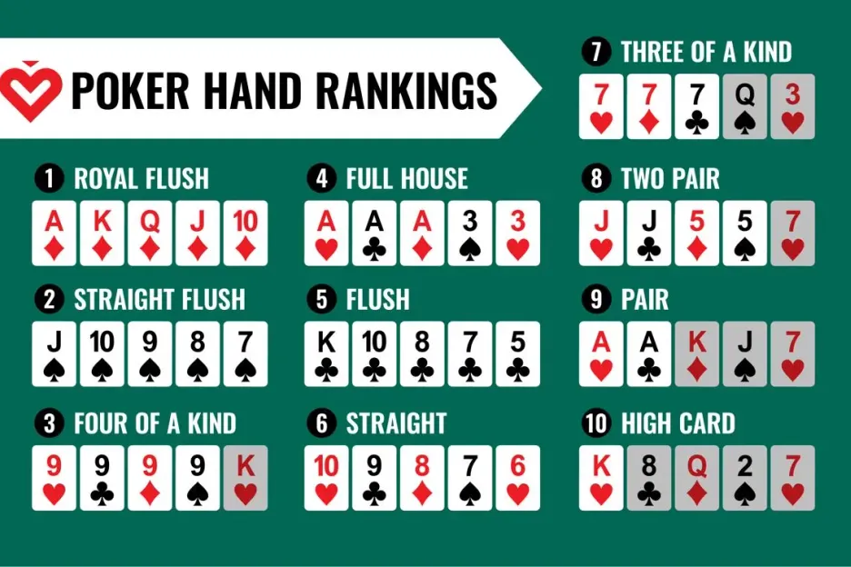

# Texas Hold'em Poker Hands Kata - Starter

This is a starter repository for the Poker Hands coding kata. The goal is to implement a Texas Hold'em poker hand evaluator.

## Getting Started

### Branch Options

Choose the branch that matches your preferred programming language:

- **`main`** - Java 8 with both JUnit 4 and JUnit 5 support
- **`jupiter-only`** - Java 8 with JUnit 5 (Jupiter) only
- **`dotnet`** - .NET 6 with xUnit
- **`python`** - Python 3.8+ with pytest
- **`typescript`** - TypeScript with Jest

## .NET Setup

This branch uses .NET 6 and xUnit for testing.

### Prerequisites
- .NET 6 SDK or later

### Build the project
```bash
dotnet build
```

### Run tests
```bash
dotnet test
```

### Project Structure

```
PokerHands/              # Your production code goes here
PokerHands.Tests/        # Your test code goes here
```

### Texas HoldEm
by Matthew D Moss, blatantly stolen from www.rubyquiz.com/quiz24.html

### Problem description:

You work for a cable network; specifically, you are the resident hacker for a Texas Hold’Em Championship show.
The show’s producer has come to you for a favor. It seems the play-by-play announcers just can’t think very fast. All beauty, no brains. The announcers could certainly flap their jaws well enough, if they just knew what hands the players were holding and which hand won the round. Since this is live TV, they need those answers quick. Time to step up to the plate. Bob, the producer, explains what you need to do.

**BOB:** Each player’s cards for the round will be on a separate line of the input. Each card is a pair of characters, the first character represents the face, the second is the suit. Cards are separated by exactly one space. 

Here’s a sample hand.

    Kc 9s Ks Kd 9d 3c 6d
    9c Ah Ks Kd 9d 3c 6d
    Ac Qc Ks Kd 9d 3c
    9h 5s
    4d 2d Ks Kd 9d 3c 6d
    7s Ts Ks Kd 9d

**YOU:** Okay, I was going ask what character to use for 10, but I guess ‘T’ is it. And ‘c’, ’d’, ‘h’ and ’s’ for the suits, makes sense. Why aren’t seven cards listed for every player?

**BOB:** Well, if a player folds, only his hole cards and the community cards he’s seen so far are shown.

**YOU:** Right. And why did the fifth player play with a 4 and 2? They’re suited, but geez, talk about risk…

**BOB:** Stay on topic. Now, the end result of your code should generate output that looks like this:

    Kc 9s Ks Kd 9d 3c 6d Full House (winner)
    9c Ah Ks Kd 9d 3c 6d Two Pair
    Ac Qc Ks Kd 9d 3c
    9h 5s
    4d 2d Ks Kd 9d 3c 6d Flush
    7s Ts Ks Kd 9d

**YOU:** Okay, so I repeat the cards, list the rank or nothing if the player folded, and the word “winner” in parenthesis next to the winning hand. Do you want the cards rearranged at all?

**BOB:** Hmmm… we can get by without it, but if you have the time, do it. Don’t bother for folded hands, but for ranked hands, move the cards used to the front of the line, sorted by face. Kickers follow that, and the two unused cards go at the end, just before the rank is listed.

**YOU:** Sounds good. One other thing, I need to brush up on the hand ranks. You have any good references for Texas Hold’Em?

**BOB:** Yeah, do an internet search on Poker Hand Rankings. And if you need it, the Rules of Texas Hold’Em. While ranking, don’t forget the kicker, the next highest card in their hand if player’s are tied. And of course, if – even after the kicker – player’s are still tied, put “(winner)” on each appropriate line of output.

**YOU:** Ok. I still don’t understand one thing…

**BOB:** What’s that?

**YOU:** Why he stayed in with only the 4 and 2 of diamonds? That’s just…

**BOB:** Hey! Show’s on in ten minutes! Get to work!

### Hand rankings (from weakest to strongest)
A quick cheat-sheet, because yes, you should know the order:



 - High card (no pair, highest card wins)
 - One pair
 - Two pairs
 - Three-of-a-kind
 - Straight (five cards in sequence, any suit)
 - Flush (five cards same suit, non-sequence)
 - Full house (three-of-a-kind + pair)
 - Four-of-a-kind
 - Straight flush (sequence + same suit)
 - Royal flush (A-K-Q-J-10 of same suit)

Each player gets two private cards (called hole cards) dealt face-down to them. 
Then five community cards are dealt face-up on the table (in stages) that all players can use. 
Using any combination of your hole cards and/or the community cards, make the best possible five-card poker hand. 


## Tips for the Kata

- Start with simple cases (high card comparison)
- Build incrementally
- Preferably use Test-Driven Development (TDD)
- Consider using design patterns (Strategy, Factory, Visitor, etc.)
- Think about how to make your code extensible for new hand types

## Resources

- [PokerHands Kata on Coding Dojo](http://codingdojo.org/kata/PokerHands/)
- [List of Poker Hands on Wikipedia](https://en.wikipedia.org/wiki/List_of_poker_hands)

Good luck and have fun!
